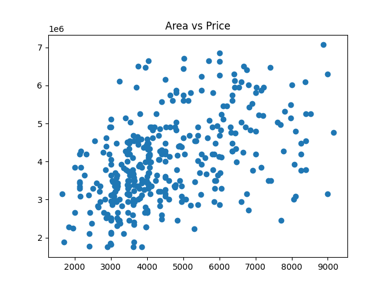
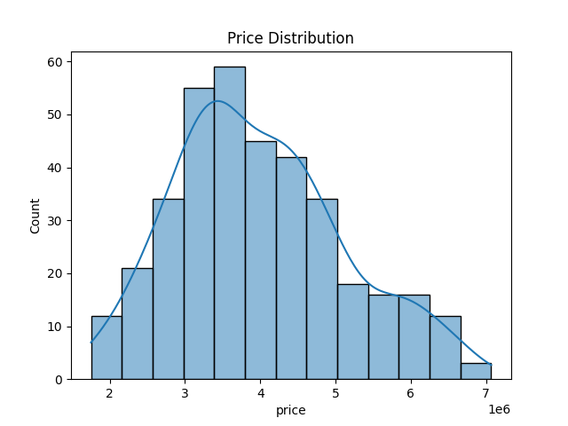
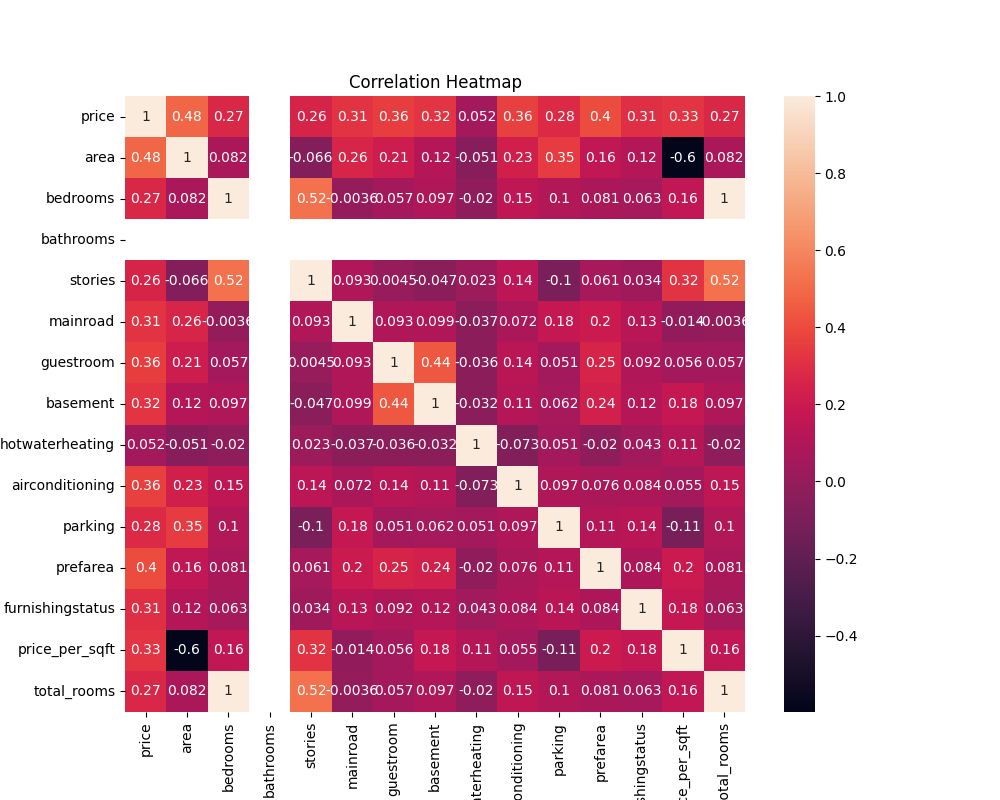
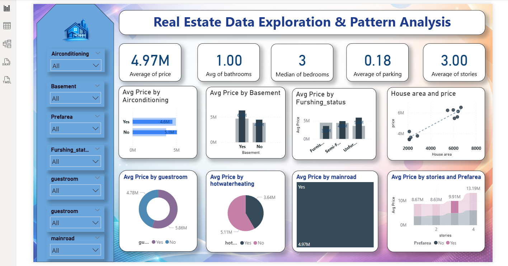

# 🏠 Real Estate Data Analysis & Price Prediction

## 📌 Overview
This project focuses on analyzing real estate housing data to uncover **price trends, key influencing factors, and investment insights**.  
It combines **data analysis, visualization, and machine learning** to build a complete end-to-end solution.

Additionally, an **interactive Power BI dashboard** is created to provide business-level insights.

---

## 🎯 Objectives
- Analyze housing data to identify pricing patterns
- Understand key factors affecting property prices
- Build a predictive model for house pricing
- Create a business dashboard for decision-making

---

## 🛠️ Tech Stack
- **Python** (Pandas, NumPy)
- **Data Visualization** (Matplotlib, Seaborn)
- **Machine Learning** (Scikit-learn)
- **Power BI** (Dashboard & Business Insights)

---

## 📊 Dataset
The dataset includes:
- Area
- Bedrooms & Bathrooms
- Furnishing Status
- Amenities (AC, Parking, Guestroom, etc.)
- Price

---

## 🔍 Data Processing Pipeline
1. Data Cleaning & Preprocessing  
2. Handling Missing Values  
3. Removing Outliers (IQR Method)  
4. Feature Engineering  
5. Exploratory Data Analysis (EDA)  
6. Data Visualization  
7. Model Building  

---

## 📈 Visualizations

### 📍 Area vs Price Relationship

### 📍 Price Distribution

### 📍 Feature Correlation Heatmap

---

## 📊 Power BI Dashboard

An interactive dashboard was built to analyze:
- Property price distribution  
- Area vs price trends  
- Impact of amenities on pricing  
- Overall investment insights  

### 📸 Dashboard Preview

---

## 🤖 Machine Learning Model
- **Model Used:** Linear Regression  
- **Train-Test Split:** 80-20  
- **Evaluation Metrics:**
  - Mean Absolute Error (MAE)
  - R² Score  

---

## 💡 Key Insights
- Property **area is the strongest driver of price**
- More **bedrooms and bathrooms increase valuation**
- **Furnishing status significantly impacts pricing**
- Amenities like **air conditioning and parking add premium value**
- Outlier removal improves model performance

---

## 🚀 Future Enhancements
- Implement advanced models (Random Forest, XGBoost)
- Deploy as a web application
- Add location-based and time-series analysis
- Integrate real-time data sources

---

## 📂 Project Structure
real-estate-data-analysis/
│
├── data/ # Raw & cleaned datasets
│ ├── Housing.csv
│ └── cleaned_housing_data.csv
│
├── src/ # Python analysis script
│ └── analysis.py
│
├── images/ # Visualizations & dashboard
│ ├── scatter.png
│ ├── histogram.png
│ ├── heatmap.png
│ └── dashboard.png
│
├── README.md
└── requirements.txt

---

## 👤 Author
**Suleman Mulani**

---

## ⭐ Project Highlights
✔ End-to-end data analysis pipeline  
✔ Machine learning integration  
✔ Power BI dashboard  
✔ Real-world problem solving  
✔ Portfolio-ready project  

---
